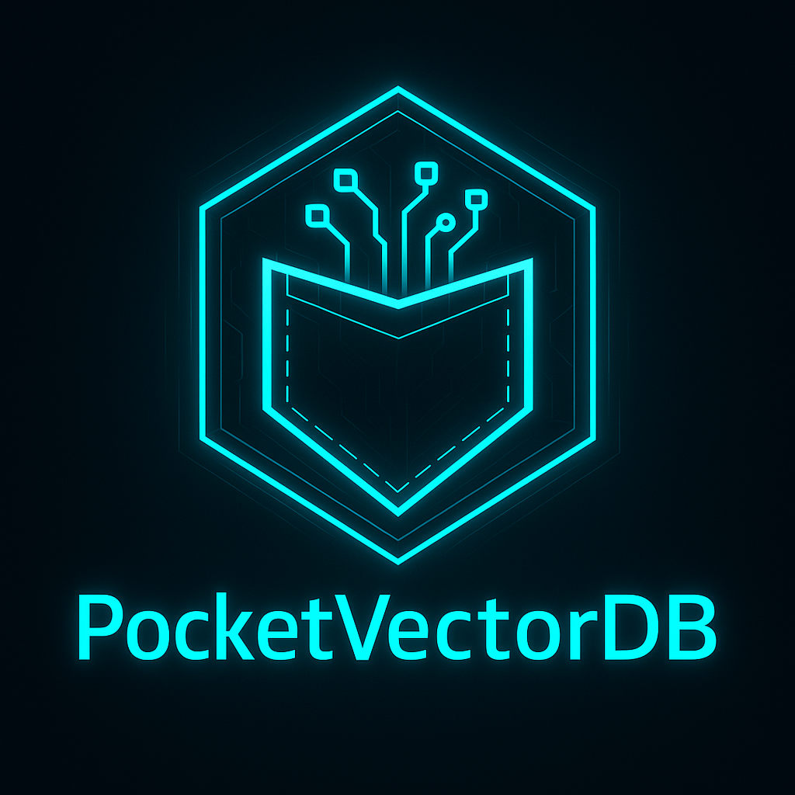

<p align="center">
  
</p>

   # PocketVectorDB  

A lightweight, fast, offline-ready vector database for Python and mobile/edge environments

PocketVectorDB is a minimal, dependency-light vector database designed for:

- Offline AI agents  
- Termux (Android) environments  
- Edge devices & IoT  
- Local LLM memory systems  
- Developers who want fast semantic search without massive dependencies

Built for simplicity and speed, PocketVectorDB stores embeddings in a compact NumPy matrix, supports metadata filtering, batch inserts, persistent storage, and cosine similarity search — all in under 10KB of Python code.

======================================================================
#  🚀 Features
======================================================================

- Ultra-lightweight: no server, no heavy frameworks  
- Fast cosine similarity search via optimized matrix operations  
- Persistent storage using `embeddings.npy` and `metadata.json`  
- Batch insert operations  
- Metadata filtering (`where={...}`)  
- Full CRUD operations  
- Zero external dependencies except NumPy  
- Works on Termux, Linux, macOS, and Windows  
- Perfect for small AI agents and local LLM memory

======================================================================
# 📦 Installation
======================================================================

### Python  
```bash
pip install pocketvectordb
```

### Termux  
Install from a local wheel:
```bash
pip install pocketvectordb-1.0.0-py3-none-any.whl
```

======================================================================
# 🧠 Quick Start
======================================================================

```python
from pocketvectordb import VectorDB
import numpy as np

db = VectorDB("./my_vectordb", dimension=384)

embedding = np.random.randn(384).astype(np.float32)
doc_id = db.add(embedding, "Hello world!", metadata={"tag": "greeting"})

query = np.random.randn(384).astype(np.float32)
results = db.query(query, n_results=3)

print(results["documents"])
```

======================================================================
# 🔍 Similarity Search
======================================================================

```python
results = db.query(query_embedding, n_results=5)
```

Returns:  
- `ids`  
- `documents`  
- `distances`  
- `metadatas`

======================================================================
# 🗂️ Metadata Filtering
======================================================================

```python
results = db.query(
    query_embedding,
    n_results=3,
    where={"category": "science"}
)
```

======================================================================
#  ✏️ Updating Documents
======================================================================

```python
db.update(
    doc_id,
    text="Updated content",
    metadata={"updated": True}
)
```

======================================================================
#  🗑️ Delete Matching Documents
======================================================================

```python
deleted_count = db.delete(where={"category": "tech"})
```

======================================================================
#  💾 Persistence
======================================================================

Every write updates:

- `embeddings.npy`  
- `metadata.json`  

Reloading is automatic:

```python
db = VectorDB("./my_vectordb")
print(db.count())
```

========================================================================
#   📊 Performance
========================================================================

Benchmarks on Android (Termux):

| Documents | Insert Time | Query Time |
|----------|-------------|------------|
| 100      | 0.017s      | 0.14 ms    |
| 500      | 0.39s       | 0.31 ms    |
| 1000     | 1.56s       | 0.53 ms    |

PocketVectorDB is optimized for fast local lookups without GPU or FAISS.


========================================================================
#  🛠️ Why PocketVectorDB?
========================================================================

Most vector databases are:  
- too heavy  
- server-based  
- cloud-locked  
- not optimized for mobile  
- overkill for small agents  

PocketVectorDB is a pure-Python, offline-first, minimalist vector engine.

Perfect for:  
- LLM memory systems  
- Personal agents  
- Offline chatbots  
- IoT classification  
- Fast lookup systems  
- Mobile AI experiments  
- Students & researchers  


========================================================================
#   ❤️ Author
========================================================================
  ThatFkrDurk561 
 
PocketVectorDB is built for developers who want speed, portability, and simplicity without massive frameworks.
